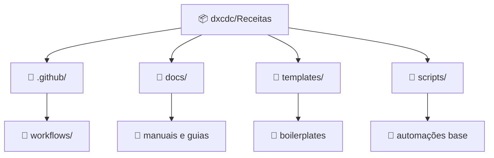
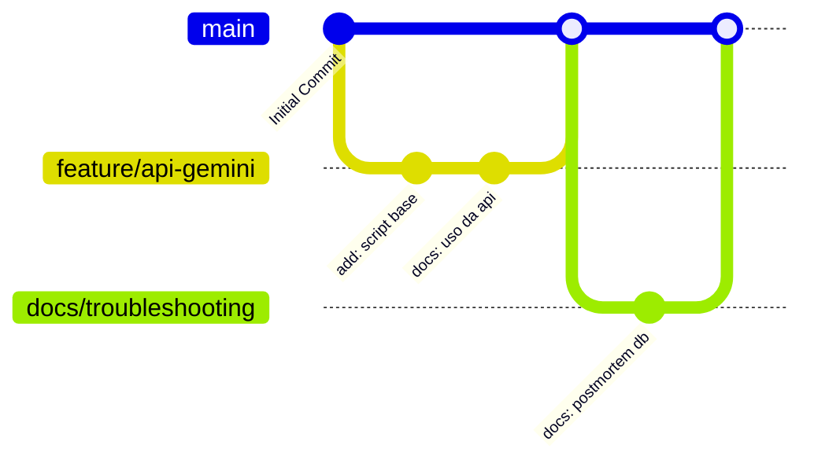

# 📚 Receitas — Repositório de Automação & Boas Práticas


Bem-vindo(a) ao **Receitas**, o núcleo central de automação e conhecimento da equipe **dxcdc**! 🚀
Este repositório serve como um hub seguro e colaborativo para **scripts reutilizáveis**, **prompts**, **boilerplates de API** e **configurações de infraestrutura (IaC)**. 

---

## 🗺️ Mapa do Repositório

Entenda como nosso repositório está organizado e onde encontrar o que você precisa:



---

## 📖 Índice de Documentação

Nossa documentação foi projetada para ser ágil e direta. Consulte a tabela abaixo para navegar rapidamente pelos guias essenciais:

| Documento | Descrição |
|-----------|-----------|
| `docs/plano_personalizacao.md` | Estratégias e arquitetura das nossas integrações. |
| `docs/politica_backup.md` | Como garantir a integridade dos nossos dados. |
| `docs/diretrizes_documentacao.md` | ADRs e padrões adotados na escrita de código e documentação. |
| `docs/troubleshooting.md` | Postmortems e resolução de problemas comuns. (Lembrete: Novas adições sempre no **TOPO**). |
| `docs/onboarding.md` | Guia rápido para novos membros da equipe. |
| `docs/seguranca_basica.md` | Boas práticas de gestão de segredos e acessos. |
| `docs/padroes_git.md` | Como nomear branches e formatar mensagens de commit. |
| `docs/arquitetura_cloud.md` | Visão geral dos componentes em nuvem utilizados pela equipe. |
| `docs/guia_estilo_python.md` | Linter, formatação e padrões adotados nos scripts Python. |

*(Nota: Os arquivos `docs/` serão preenchidos incrementalmente. Siga os links correspondentes à medida que as issues são concluídas).*

---

## 🚀 Quick Start

**Siga os passos abaixo para preparar seu ambiente local:**

1. **Clone o repositório:**
   ```bash
   git clone https://github.com/dxcdc/Receitas.git
   cd Receitas
   ```

2. **Configure o Ambiente:**
   ```bash
   # Copie as variáveis de exemplo
   cp .env.example .env
   ```
   *Nunca commite o seu arquivo `.env`!*

3. **Explore e utilize!**
   Abra a pasta `scripts/` e encontre o que precisa, seja direto e prático!

---

## 🌳 Visualização de Branches

Uma das melhores maneiras de entender o ciclo de vida do nosso código é visualizar o histórico. Utilize aliases do git como `git log --graph --oneline --all` ou aproveite o formato abaixo para visualizar como trabalhamos com *branches*:



---

## 🔐 Segurança

Para garantir a integridade do nosso hub, temos políticas estritas e inegociáveis:
- **ZERO SENHAS no Código**: Nunca coloque tokens, webhooks ou senhas "hardcoded".
- **Use Variáveis de Ambiente**: Sempre puxe informações sensíveis via `os.getenv` ou equivalente.
- **Placeholders Explícitos**: Se precisar dar exemplo no código ou na documentação, use formatação clara como `<GEMINI_API_KEY>` ou `<MATTERMOST_WEBHOOK_URL>`.

---

## 🤝 Contribuição

Quer adicionar uma nova receita incrível? 
- Crie uma branch a partir da `main`.
- Desenvolva seu script e a respectiva documentação.
- Abra um **Pull Request (PR)** explicando "o que", "por que" e "como".
- Se for adicionar logs de incidentes em arquivos de *troubleshooting*, **coloque sua nova entrada sempre no TOPO do arquivo**, preservando o histórico antigo.

---

## 📋 ADRs (Decisões de Arquitetura)

Todas as nossas Decisões de Arquitetura (Architecture Decision Records) e convenções de projeto encontram-se sumarizadas no documento [Diretrizes de Documentação](docs/diretrizes_documentacao.md).

---
*Equipe DevOps dxcdc — Mantido com 🩵 e café.*
