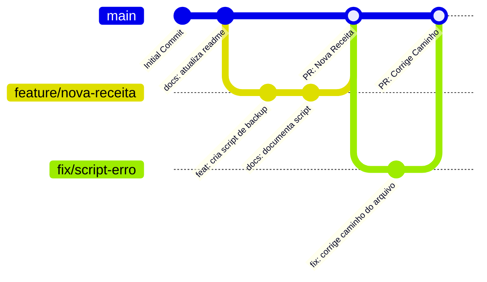
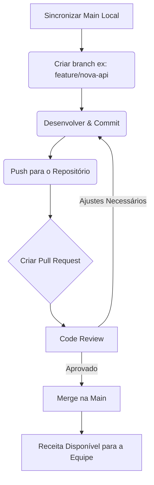

# 🌳 Estratégia de Execução — Git, Branches & Contribuição

Bem-vindo(a) à nossa estratégia de versionamento! Ter uma estratégia de Git clara é fundamental para evitarmos conflitos, garantirmos estabilidade e mantermos o histórico do nosso repositório de receitas limpo e compreensível. O nosso objetivo é que todos se sintam seguros para contribuir.

---

## 1. Modelo de Branches (Feature Branch Workflow)

Adotamos o **Feature Branch Workflow**. A branch `main` é sagrada e reflete sempre a versão estável e validada das nossas receitas. Todo novo desenvolvimento deve ocorrer em branches derivadas e, posteriormente, integradas via Pull Request.

### Nomenclatura das Branches

Para criar sua branch, utilize um dos prefixos abaixo seguido do nome descritivo da tarefa (sempre em minúsculas e separado por hifens):

- `feature/` - Para novas receitas, scripts ou funcionalidades.
- `fix/` - Para correção de bugs ou receitas quebradas.
- `docs/` - Para melhorias na documentação.
- `chore/` - Para tarefas de rotina, atualizações de dependências e configuração.

**Exemplo:** `git checkout -b feature/novo-prompt-ia`

### Fluxo de Branches (Visualização)



---

## 2. Padrão de Commits (Conventional Commits)

Nossos commits seguem a convenção **Conventional Commits** para padronizar o histórico e facilitar a geração de changelogs automáticos.

| Prefixo | Descrição | Exemplo de Uso |
| :--- | :--- | :--- |
| **feat** | Adição de uma nova funcionalidade, receita ou script. | `feat: adiciona script de backup rclone` |
| **fix** | Correção de um bug ou erro em uma receita existente. | `fix: corrige erro de sintaxe no boilerplate` |
| **docs** | Alterações exclusivas na documentação. | `docs: atualiza diretrizes de contribuicao` |
| **ci** | Modificações em arquivos e scripts de CI/CD (GitHub Actions). | `ci: adiciona fluxo de lint para python` |
| **chore** | Atualizações de rotina, mudança de ferramentas, sem alterar código de produção. | `chore: atualiza dependencias do projeto` |
| **refactor** | Refatoração de código sem adicionar funcionalidade ou corrigir bug. | `refactor: simplifica loop principal do script` |
| **test** | Adição ou correção de testes automatizados. | `test: adiciona testes unitarios para modulo api` |

---

## 3. Processo de Pull Request (PR)

Toda contribuição para a branch `main` deve passar por um **Pull Request**. Isso garante que outras pessoas da equipe possam revisar a qualidade e a segurança das receitas.

### Template de Pull Request

Ao criar um PR, preencha o template a seguir na descrição:

```markdown
## Descrição da Mudança
*Explique brevemente o que foi feito.*

## Tipo de Mudança
- [ ] Nova Receita (`feat`)
- [ ] Correção (`fix`)
- [ ] Documentação (`docs`)

## Checklist de Qualidade e Segurança
- [ ] Meu código segue as diretrizes do projeto.
- [ ] Testei a receita/script localmente.
- [ ] Nenhum token real, chave de API ou senha foi adicionado aos arquivos (uso de `<PLACEHOLDER>` ou `os.getenv`).
- [ ] Atualizei a documentação correspondente.
```

---

## 4. Diretrizes de Code Review

- **Empatia e Colaboração:** Revisões de código existem para compartilhar conhecimento. Seja construtivo nos comentários.
- **Foco na Segurança:** Verifique com atenção redobrada a ausência de dados sensíveis hardcoded (senhas, webhooks, chaves).
- **Testes Mínimos:** Garanta que há clareza em como testar a nova receita adicionada.

---

## 5. Processo de Release (Estabilidade da `main`)

A branch `main` é mantida em estado implantável o tempo todo. 
- Nunca commite diretamente na `main`.
- Merge de PRs deve ser realizado preferencialmente via *Squash and Merge* para manter o histórico da `main` conciso, caso haja muitos commits "de progresso" na branch da feature.

---

## 6. Diagrama de Fluxo de Contribuição

Veja de forma simplificada o fluxo de vida de uma contribuição:


