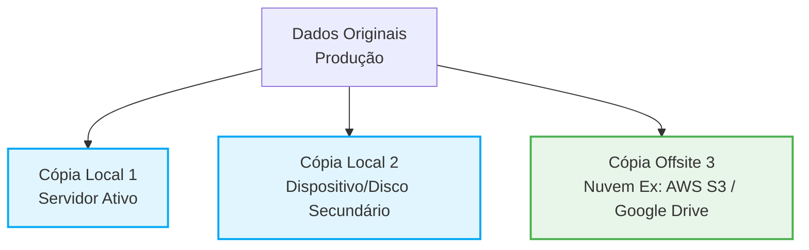

# 💾 Política de Backup 3-2-1

Bem-vindo(a) à Política de Backup do repositório de Receitas! Proteger os dados críticos da nossa organização e a configuração dos nossos scripts é fundamental para garantir a continuidade dos serviços. Aqui adotamos a consagrada estratégia 3-2-1 para assegurar que seus dados não serão perdidos sob nenhuma hipótese.

## Estratégia 3-2-1



**Conceito detalhado:**
- **3 Cópias:** O dado original de produção mais duas cópias de backup isoladas.
- **2 Mídias diferentes:** Por exemplo, disco local da máquina, storage NAS na rede, ou volumes separados.
- **1 Offsite (fora do local):** Pelo menos uma cópia precisa estar remotamente localizada, preferencialmente na nuvem, protegendo contra incêndios, acidentes locais e desastres físicos.

## Ferramentas

Utilizamos o **rclone** como a principal ferramenta de sincronização devido à sua versatilidade para conversar com múltiplos provedores em nuvem (S3, GDrive, Azure, etc.) com criptografia ponta-a-ponta e validação de hash embutidas.

## Agendamento

Recomenda-se a utilização do `cron` no sistema Linux para programar as rotinas.
**Sugestão:**
- Backups diferenciais/diários (toda meia-noite): `0 0 * * *`
- Backups consolidados/semanais (domingo à 1 da manhã): `0 1 * * 0`

## Verificação de Integridade

O rclone valida os arquivos copiados, mas sugerimos checar os checksums ativamente ou realizar testes de restauração. 
- Use `rclone check origem destino` regularmente para validar se não há divergências nos blocos armazenados.
- Testes práticos (restaurar uma cópia aleatória para uma pasta temporária) devem ser feitos a cada trimestre.

## Política de Retenção

Para economizar armazenamento e manter janelas seguras:
- **Diários:** Manter por 7 dias.
- **Semanais:** Manter por 4 semanas.
- **Mensais:** Manter por 12 meses.
*(As limpezas podem ser feitas via scripts locais ou através da configuração de ciclo de vida do próprio bucket da nuvem).*

## Procedimento de Restauração

Caso o pior aconteça e precisemos recuperar arquivos urgentes, siga o passo a passo:

1. **Acesse a máquina limpa de destino.**
2. **Configure o rclone temporariamente (caso não exista):** `rclone config`
3. **Execute o comando de cópia reversa usando seu remote configurado:**

```bash
# Recuperação completa de uma pasta
rclone copy <NOME_DO_REMOTE_PLACEHOLDER>:bucket-de-backup/producao /caminho/destino/recuperacao --progress
```

> [!CAUTION]
> Durante uma restauração, evite sobrescrever dados existentes (use o comando `copy` para uma nova pasta ao invés de usar `sync`, minimizando a chance de excluir arquivos que não foram salvos ou atualizados no último ciclo).
